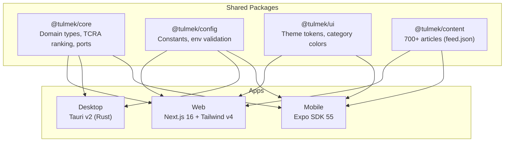

<div align="center">

# TULMEK

### AI-Powered Interview Prep Knowledge Hub

**700+ articles from 8 sources, ranked by TCRA. Refreshed every 3 hours. Zero backend.**

[](https://github.com/coast-guide-sahil/tulmek/actions/workflows/ci.yml)
[](LICENSE)
[](https://github.com/coast-guide-sahil/tulmek/stargazers)
[](https://github.com/coast-guide-sahil/tulmek/commits/main)
[](https://www.typescriptlang.org/)
[](https://github.com/coast-guide-sahil/tulmek/pulls)

[**Open Web App**](https://tulmek.com) &#183; [Download Desktop](https://github.com/coast-guide-sahil/tulmek/releases?q=desktop) &#183; [Download Android](https://github.com/coast-guide-sahil/tulmek/releases?q=mobile) &#183; [Report Bug](https://github.com/coast-guide-sahil/tulmek/issues)

</div>

---

## What is TULMEK?

TULMEK aggregates interview-prep content from across the internet into one fast, searchable feed. No sign-up. No server. Everything runs client-side.

- **8 sources** -- Reddit, Hacker News, DEV Community, LeetCode, Medium, GitHub, YouTube, Newsletters
- **8 categories** -- DSA, System Design, AI/ML, Behavioral, Career, Interview Experiences, Compensation, General
- **TCRA ranking** -- multi-signal algorithm (relevance, freshness decay, source credibility, trending detection, personalization)
- **Cross-platform** -- Web, Desktop (Linux/macOS/Windows), and Mobile (Android)
- **Offline-first** -- all data stored locally, works without network after first load

## Get the App

| Platform | How to access | Stack |
|----------|---------------|-------|
| **Web** | [tulmek.com](https://tulmek.com) | Next.js 16, Tailwind CSS v4, Orama search |
| **Desktop** | [Download from Releases](https://github.com/coast-guide-sahil/tulmek/releases?q=desktop) | Tauri v2 (Rust + WebView) |
| **Mobile** | [Download APK from Releases](https://github.com/coast-guide-sahil/tulmek/releases?q=mobile) | Expo SDK 55, React Native 0.83 |

No account required. No tracking. Your data stays on your device.

---

## Developer Quick Start

```bash
git clone https://github.com/coast-guide-sahil/tulmek.git
cd tulmek
corepack enable
pnpm install
pnpm dev          # web app at http://localhost:3000
```

### Prerequisites

| Tool | Version | Check |
|------|---------|-------|
| Node.js | 24+ | `node -v` |
| pnpm | 10+ | `corepack enable` |
| Git | any | `git --version` |

### Platform-Specific Setup

<details>
<summary><strong>Web</strong> -- no extra deps, works out of the box</summary>

```bash
pnpm dev                                    # dev server with Turbopack
pnpm --filter @tulmek/web build             # production build
pnpm --filter @tulmek/web e2e               # 51 Playwright tests
```

</details>

<details>
<summary><strong>Desktop</strong> -- requires Rust 1.94+</summary>

1. Install Rust:
   ```bash
   curl --proto '=https' --tlsv1.2 -sSf https://sh.rustup.rs | sh
   ```
2. Install system dependencies (Ubuntu/Debian):
   ```bash
   sudo apt install libwebkit2gtk-4.1-dev libayatana-appindicator3-dev \
     librsvg2-dev patchelf libssl-dev libgtk-3-dev
   ```
3. Start the web dev server first: `pnpm dev`
4. In another terminal:
   ```bash
   cd apps/desktop && pnpm dev        # launches native window
   cd apps/desktop && pnpm tauri:build # production binary
   ```

</details>

<details>
<summary><strong>Mobile</strong> -- requires Android SDK or Expo Go</summary>

1. Install Android SDK (CLI-only, ~2 GB):
   ```bash
   mkdir -p ~/android-sdk/cmdline-tools
   # Download from https://developer.android.com/studio#command-line-tools-only
   export ANDROID_HOME=~/android-sdk
   export PATH=$ANDROID_HOME/cmdline-tools/latest/bin:$ANDROID_HOME/platform-tools:$ANDROID_HOME/emulator:$PATH
   sdkmanager "platform-tools" "emulator" "platforms;android-34" \
     "system-images;android-34;google_apis;x86_64"
   ```
2. Create an emulator:
   ```bash
   avdmanager create avd -n test \
     -k "system-images;android-34;google_apis;x86_64" -d pixel_6
   ```
3. Increase inotify watchers:
   ```bash
   sudo sysctl -w fs.inotify.max_user_watches=524288
   ```
4. Launch the emulator and start the app:
   ```bash
   emulator -avd test -gpu host
   adb reverse tcp:8081 tcp:8081
   cd apps/mobile && pnpm dev
   ```

</details>

<details>
<summary><strong>Content management</strong> -- fetch and validate articles</summary>

```bash
cd apps/web
pnpm fetch-hub-content       # fetch fresh articles from 8 sources
pnpm validate-content        # validate all JSON against Zod schemas
```

</details>

---

## Architecture

TULMEK uses **clean architecture (ports and adapters)** inside a Turborepo monorepo. Shared domain logic lives in `packages/core` (zero dependencies). Each platform provides its own adapters.



```
UI (React / React Native) --> Ports (interfaces in @tulmek/core) --> Adapters (platform-specific)
```

Swap any adapter by creating a new implementation of the port interface. See [docs/guides/swapping-providers.md](docs/guides/swapping-providers.md).

<details>
<summary><strong>Monorepo structure</strong></summary>

```
tulmek/
├── apps/
│   ├── web/                  # Next.js 16 -- primary platform
│   │   ├── src/app/          # Pages + layouts (App Router)
│   │   ├── src/components/   # 33 hub components, progress tracker
│   │   ├── src/infrastructure/ # Adapters (Orama, localStorage)
│   │   ├── src/lib/          # Providers, stores (Zustand)
│   │   └── scripts/          # Content fetcher (8 sources)
│   ├── desktop/              # Tauri v2 -- native desktop shell
│   │   └── src-tauri/        # Rust backend + config
│   └── mobile/               # Expo SDK 55 -- React Native
│       └── app/              # Expo Router screens
├── packages/
│   ├── core/                 # Zero-dep domain logic + port interfaces
│   ├── config/               # Constants, env validation
│   ├── content/              # Shared article data (single source of truth)
│   ├── ui/                   # Theme tokens, category colors
│   ├── typescript-config/    # Shared tsconfig bases
│   └── eslint-config/        # Shared ESLint rules
├── docs/
│   ├── decisions/            # Architecture Decision Records
│   └── guides/               # Provider swapping, deployment
└── turbo.json                # Task pipeline
```

</details>

<details>
<summary><strong>Code sharing matrix</strong></summary>

| Layer | Package | Used by |
|-------|---------|---------|
| Domain types + TCRA ranking | `@tulmek/core/domain` | Web, Desktop, Mobile |
| Port interfaces (9 ports) | `@tulmek/core/ports` | Web, Desktop, Mobile |
| Constants + storage keys | `@tulmek/config/constants` | Web, Desktop, Mobile |
| Theme tokens | `@tulmek/ui` | Web, Mobile |
| Article feed data | `@tulmek/content` | Web, Mobile |
| Web adapters | `apps/web/infrastructure/` | Web only |
| Web UI components | `apps/web/components/` | Web only |
| Mobile screens | `apps/mobile/app/` | Mobile only |
| Desktop backend | `apps/desktop/src-tauri/` | Desktop only |

</details>

<details>
<summary><strong>TCRA ranking algorithm</strong></summary>

The **TULMEK Core Ranking Algorithm** produces interview-prep-optimized content ordering. It runs entirely client-side.

| Signal | Description |
|--------|-------------|
| **Content Relevance** | Multi-signal composite score (engagement, comments, reading time) |
| **Freshness Decay** | Per-category exponential decay with floors (DSA is evergreen, compensation data goes stale fast) |
| **Source Credibility** | Baseline trust per source (LeetCode 0.9, HN 0.85, Reddit 0.6, etc.) |
| **Source Diversity** | sqrt-proportional quota interleaving to prevent feed monoculture |
| **Trending Detection** | Velocity-based burst detection over a 7-day window |
| **Personalization** | Client-side preference profiling from reading history |

</details>

---

## Commands

| Command | Description |
|---------|-------------|
| `pnpm dev` | Start web dev server (Turbopack, port 3000) |
| `pnpm build` | Build all packages + apps |
| `pnpm lint` | ESLint across all packages |
| `pnpm typecheck` | TypeScript checking across all packages |
| `pnpm test` | Unit tests (Vitest) |
| `pnpm e2e` | E2E tests (Playwright, from `apps/web`) |
| `cd apps/web && pnpm fetch-hub-content` | Fetch articles from 8 sources |
| `cd apps/web && pnpm validate-content` | Validate content JSON against Zod schemas |

## CI/CD

| Pipeline | Trigger | What it does |
|----------|---------|-------------|
| **CI** | Every PR | Lint, typecheck, unit tests, build, E2E (51 Playwright tests), accessibility |
| **Lighthouse** | Every PR | Performance, accessibility, SEO, best practices monitoring |
| **Web deploy** | Merge to `main` | Vercel auto-deploy to [tulmek.com](https://tulmek.com) |
| **Desktop release** | Tag `desktop-v*` | Tauri multi-platform builds (Linux/macOS/Windows) |
| **Mobile release** | Tag `mobile-v*` | Android APK build via GitHub Actions |
| **Content refresh** | Every 3 hours | Fetch from 8 sources, deduplicate, rank, commit |

## Environment Variables

| Variable | Description | Required |
|----------|-------------|----------|
| `NEXT_PUBLIC_APP_URL` | Public app URL | No (defaults to `http://localhost:3000`) |
| `ANDROID_HOME` | Android SDK path | Mobile development only |

## Contributing

Contributions are welcome! Please:

1. Fork the repo and create a feature branch
2. Follow the existing code style (ESLint + Prettier enforced)
3. Add tests for new functionality
4. Run `pnpm lint && pnpm typecheck && pnpm test` before submitting
5. Open a PR against `main`

See [docs/decisions/](docs/decisions/) for architecture context and [docs/guides/](docs/guides/) for implementation guides.

## License

[MIT](LICENSE) -- Sk Sahil
